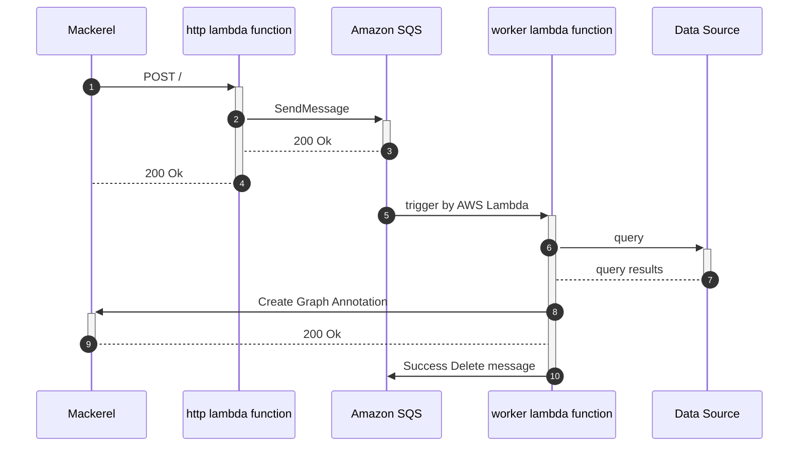

# prepalert


[](https://github.com/mashiike/prepalert/blob/master/LICENSE)

Toil reduction tool to prepare before responding to Mackerel alerts

`preplert` consists of two parts: a webhook server that receives Mackerel webhooks and sends the payload to Amazon SQS, and a worker that queries various data based on the webhooks and pastes information for alert response as a GraphAnnotation.


## Install 

#### Homebrew (macOS and Linux)

```console
$ brew install mashiike/tap/prepalert
```

### Binary packages

[Releases](https://github.com/mashiike/prepalert/releases)

## QuickStart 

Set your Mackerel API key to the environment variable `MACKEREL_APIKEY`.  
and Execute the following command:

```shell
$ prepalert init 
```

Or the following command:
```shell 
$ prepalert --coinfig <output config path> init
```

## Usage 

```
Usage: prepalert <command>

A webhook server for prepare alert memo

Flags:
  -h, --help                      Show context-sensitive help.
      --log-level="info"          output log-level ($PREPALERT_LOG_LEVEL)
      --mackerel-apikey=STRING    for access mackerel API ($MACKEREL_APIKEY)
      --config="."                config path ($PREPALERT_CONFIG)

Commands:
  run
    run server (default command)

  init
    create inital config

  validate
    validate the configuration

  exec <alert-id>
    Generate a virtual webhook from past alert to execute the rule

  version
    Show version

Run "prepalert <command> --help" for more information on a command.
```

If the command is omitted, the run command is executed.

## Configurations

Configuration file is HCL (HashiCorp Configuration Language) format. `prepalert init` can generate a initial configuration file.

The most small configuration file is as follows:
```hcl
prepalert {
    required_version = ">=v0.2.0"
    sqs_queue_name   = "prepalert"
    service          = "prod"
}

rule "any_alert" {
    alert {
        any = true
    }

    information = <<EOF
How do you respond to alerts?
Describe information about your alert response here.
(This area can use Go's template notation.)
EOF
}
```

For more advanced configuration, please see [docs directory](docs/) 

## Usage with AWS Lambda (serverless)

prepalert works with AWS Lambda and Amazon SQS.

Lambda Function requires a webhook and a worker





Let's solidify the Lambda package with the following zip arcive (runtime `provided.al2`)

```
lambda.zip
├── bootstrap    # build binary
└── config.hcl   # configuration file
```

A related document is [https://docs.aws.amazon.com/lambda/latest/dg/runtimes-custom.html](https://docs.aws.amazon.com/lambda/latest/dg/runtimes-custom.html)

for example.

deploy two lambda functions, prepalert-http and prepalert-worker in [lambda directory](lambda/)  
The example of lambda directory uses [lambroll](https://github.com/fujiwara/lambroll) for deployment.

For more information on the infrastructure around lambda functions, please refer to [example.tf](lambda/example.tf).

## LICENSE

MIT License

Copyright (c) 2022 IKEDA Masashi
