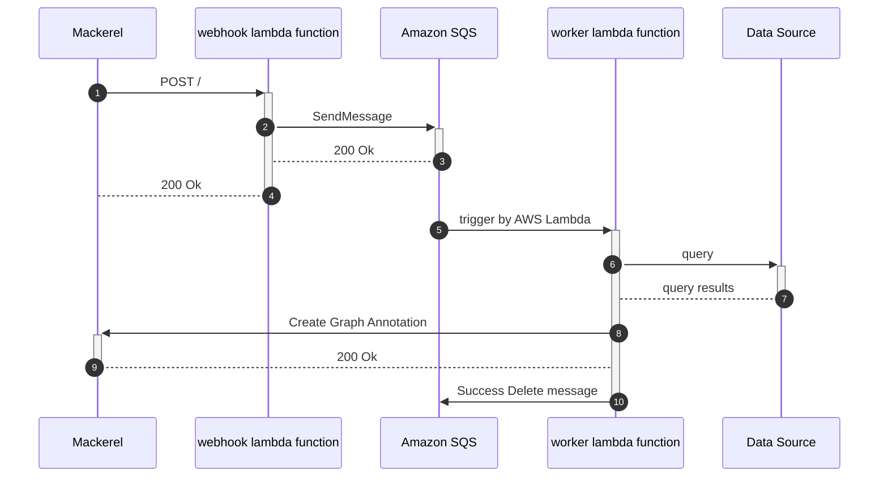

# prepalert


[](https://github.com/mashiike/prepalert/blob/master/LICENSE)

Toil reduction tool to prepare before responding to Mackerel alerts

`preplert` consists of two parts: a webhook server that receives Mackerel webhooks and sends the payload to Amazon SQS, and a worker that queries various data based on the webhooks and pastes information for alert response as a GraphAnnotation.


## Install 

### Binary packages

[Releases](https://github.com/mashiike/prepalert/releases)

## Usage with AWS Lambda (serverless)

prepalert works with AWS Lambda and Amazon SQS.

Lambda Function requires a webhook and a worker




The most small configuration file is as follows:
```hcl
prepalert {
    required_version = ">=v0.2.0"
    sqs_queue_name   = "prepalert"
    service          = "prod"
}

rule "any_alert" {
    alert {
        any = true
    }

    infomation = <<EOF
How do you respond to alerts?
Describe information about your alert response here.
(This area can use Go's template notation.)
EOF
}
```

Let's solidify the Lambda package with the following configuration (runtime `provided.al2`)

```
lambda.zip
├── bootstrap    # build binary
└── config.yaml  # configuration file
```

A related document is [https://docs.aws.amazon.com/lambda/latest/dg/runtimes-custom.html](https://docs.aws.amazon.com/lambda/latest/dg/runtimes-custom.html)

## LICENSE

MIT License

Copyright (c) 2022 IKEDA Masashi
