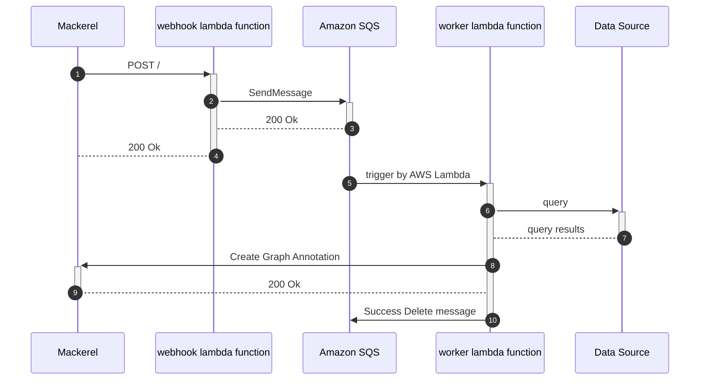

# prepalert


[](https://github.com/mashiike/prepalert/blob/master/LICENSE)

Toil reduction tool to prepare before responding to Mackerel alerts

`preplert` consists of two parts: a webhook server that receives Mackerel webhooks and sends the payload to Amazon SQS, and a worker that queries various data based on the webhooks and pastes information for alert response as a GraphAnnotation.


## Install 

### Binary packages

[Releases](https://github.com/mashiike/prepalert/releases)

## Usage with AWS Lambda (serverless)

prepalert works with AWS Lambda and Amazon SQS.

Lambda Function requires a webhook and a worker




The basic configuration file is as follows:
```yaml
required_version: ">=v0.0.0"

# Basic Authentication information to be set in the webhook
# If not set, Basic Authentication is not performed.
auth:
  client_id: hoge
  client_secret: hoge

service: prod # Where to submit Mackerel graph annotations
sqs_queue_name: prepalert # Name of the SQS queue to be used by prepalert

# The query runner is a setting for executing a query with each rule described later.
query_runners:
  - name: default
    type: RedshiftData
    cluster_identifier: warehouse
    database: "dev"
    db_user: "warehouse"

# Alert handling rules to create graph annotations
rules:
  - monitor:
      id: xxxxxxxxxxx # ID of the rule you are responding to.
    queries:
      - name: access_data
        runner: default # Setting which query runner to use
        file: ./queries/get_access_data.sql # Path to the query file 
                                            # It is also possible to use a `query` instead of a file.

    memo:
      file: ./memo/xxxxxxxxxxx.txt  # Path to file to memo template
                                    # It is also possible to use a `text` instead of a file. 
```

example query file:
```sql
SELECT
    path, count(*) as cnt
FROM access_log
WHERE access_at
    BETWEEN 'epoch'::TIMESTAMP + interval '{{ .Alert.OpenedAt }} seconds'
    AND 'epoch'::TIMESTAMP + interval '{{ .Alert.ClosedAt }} seconds'
GROUP BY 1
```
Alert information can be filled in using Tamplate as shown above.

example memo file;
```
access_log info
{{ index .QueryResults `access_data` | to_table }}
```

Let's solidify the Lambda package with the following configuration (runtime `provided.al2`)

```
lambda.zip
├── bootstrap    # build binary
└── config.yaml  # configuration file
```

A related document is [https://docs.aws.amazon.com/lambda/latest/dg/runtimes-custom.html](https://docs.aws.amazon.com/lambda/latest/dg/runtimes-custom.html)

## LICENSE

MIT License

Copyright (c) 2022 IKEDA Masashi
