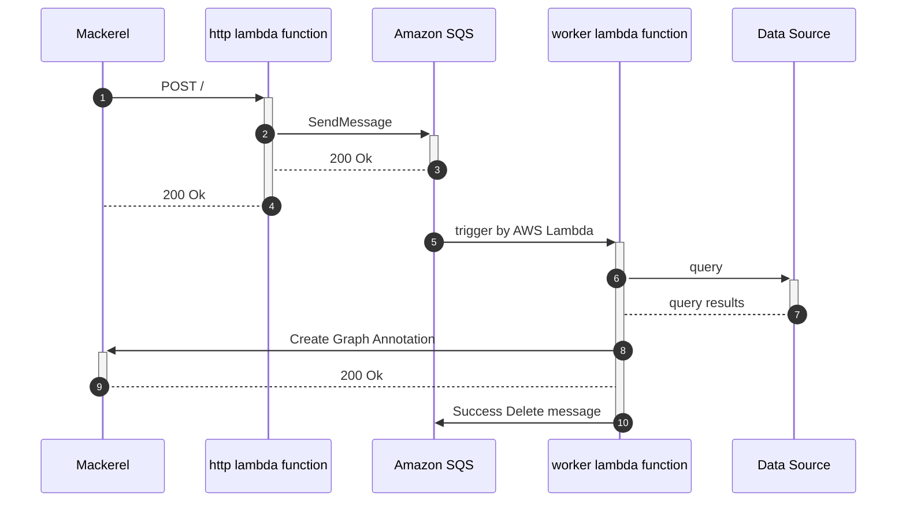

# prepalert


[](https://github.com/mashiike/prepalert/blob/master/LICENSE)

Toil reduction tool to prepare before responding to Mackerel alerts

`preplert` consists of two parts: a webhook server that receives Mackerel webhooks and sends the payload to Amazon SQS, and a worker that queries various data based on the webhooks and pastes information for alert response as a GraphAnnotation.


## Install 

#### Homebrew (macOS and Linux)

```console
$ brew install mashiike/tap/prepalert
```

### Binary packages

[Releases](https://github.com/mashiike/prepalert/releases)

## QuickStart 

Set your Mackerel API key to the environment variable `MACKEREL_APIKEY`.  
and Execute the following command:

```shell
$ prepalert init 
```

Or the following command:
```shell 
$ prepalert --coinfig <output config path> init
```

## Usage 

```
Usage: prepalert <command>

A webhook server for prepare alert memo

Flags:
  -h, --help                      Show context-sensitive help.
      --log-level="info"          output log-level ($PREPALERT_LOG_LEVEL)
      --mackerel-apikey=STRING    for access mackerel API ($MACKEREL_APIKEY)
      --config="."                config path ($PREPALERT_CONFIG)

Commands:
  run
    run server (default command)

  init
    create initial config

  validate
    validate the configuration

  exec <alert-id>
    Generate a virtual webhook from past alert to execute the rule

  version
    Show version

Run "prepalert <command> --help" for more information on a command.
```

If the command is omitted, the run command is executed.

## Configurations

Configuration file is HCL (HashiCorp Configuration Language) format. `prepalert init` can generate a initial configuration file.

The most small configuration file is as follows:
```hcl
prepalert {
    required_version = ">=v0.12.0"
    sqs_queue_name   = "prepalert"
}

locals {
    default_message =  <<EOF
How do you respond to alerts?
Describe information about your alert response here.
EOF
}

rule "simple" {
    // rule execute when org_name is "Macker..." and alert id is "4gx..."
    when = [
        webhook.org_name == "Macker...",
        get_monitor(webhook.alert).id == "4gx...",
    ]
    update_alert {
        memo = local.default_message
    }
}
```

## Usage with AWS Lambda (serverless)

prepalert works with AWS Lambda and Amazon SQS.

Lambda Function requires a webhook and a worker





Let's solidify the Lambda package with the following zip arcive (runtime `provided.al2`)

```
lambda.zip
├── bootstrap    # build binary
└── config.hcl   # configuration file
```

A related document is [https://docs.aws.amazon.com/lambda/latest/dg/runtimes-custom.html](https://docs.aws.amazon.com/lambda/latest/dg/runtimes-custom.html)

for example.

deploy lambda function, prepalert in [lambda directory](lambda/)  
The example of lambda directory uses [lambroll](https://github.com/fujiwara/lambroll) for deployment.

## Advanced Usage

### Plugin System 

prepalert has a plugin system. you can add custom provider. plugin is gRPC Server program. 
protocol buffer definition is [here](plugin/proto/prepalert.proto)

in Go language, following code is example plugin.

```go
package main

import (
	"context"

	"github.com/mashiike/prepalert/plugin"
	"github.com/mashiike/prepalert/provider"
)

type Provider struct {
	// ...
}

func (p *Provider) ValidateProviderParameter(ctx context.Context, pp *provider.ProviderParameter) error {
	/*
		Your custom provider parameter validation
	*/
	return nil
}

func (p *Provider) GetQuerySchema(ctx context.Context) (*plugin.Schema, error) {
	/*
		Your custom provider's query paramete schema
	*/
	return &plugin.Schema{}, nil
}

func (p *Provider) RunQuery(ctx context.Context, req *plugin.RunQueryRequest) (*plugin.RunQueryResponse, error) {
	/*
		Your custom provider's query execution
	*/
	return &plugin.RunQueryResponse{
		Name:    req.QueryName,
		Query:   "<your query string>",
		Columns: []string{"<column name>", "<column name>", "<column name>"},
		Rows: [][]string{
			{"<row value>", "<row value>", "<row value>"},
			{"<row value>", "<row value>", "<row value>"},
			{"<row value>", "<row value>", "<row value>"},
		},
	}, nil
}

func main() {
	plugin.ServePlugin(plugin.WithProviderPlugin(&Provider{}))
}
```
example plugin is [cmd/example-http-csv-plugin](cmd/example-http-csv-plugin/main.go)

configuration is as follows:

```hcl
prepalert {
  required_version = ">=v0.12.0"
  sqs_queue_name   = "prepalert"

  plugins {
    http = {
      cmd         = "go run github.com/mashiike/prepalert/cmd/example-http-csv-plugin@latest" // your plugin execution command
      sync_output = true  // sync plugin output to prepalert log
    }
  }
}

provider "http" {
  endpoint = "<your csv server endpoint>"
}

query "http" "csv" {}

rule "always" {
  when = true
  update_alert {
    memo = "${query.http.csv.result.query}\n${result_to_table(query.http.csv)}"
  }
}
```

## LICENSE

MIT License

Copyright (c) 2022 IKEDA Masashi
